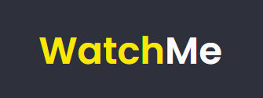
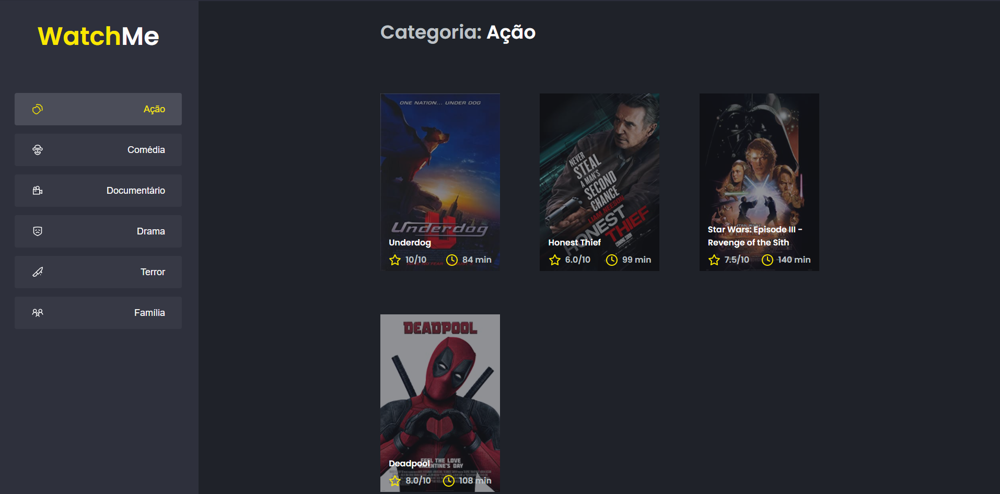

<h1 align="center" >
  
</h1>


<p align="center">Consulte os melhores filmes aqui! 💛</p>


---

## 💡 Sobre

A aplicação possibilita visualizar filmes por categoria!

Este projeto foi construído durante o Bootcamp Ignite da [Rocketseat](https://rocketseat.com.br/).

---

## 🎨 Layout

<p align="center">
  

</p>

---


## 💻 Executando o Watch-me

### Pré-requisitos

É necessário ter instalado na sua máquina para execução desse projeto:
- NodeJS
- Gerenciador de pacotes (Npm ou Yarn) 


### 👾 Clonando o Repositório

```bash

$ git clone https://github.com/karlos-silva/watch-me.git

# entre na pasta do projeto

$ cd watch-me

```
### 💻 Rodando o Watch-me 

Instale as dependências

```bash

$ yarn

```

Rode a Json Server (Backend)

```bash

$ yarn server

```
Em outro terminal, rode a aplicação

```bash

$ yarn start

```

<br>

Se tudo deu certo, o app deve estar disponível agora! 👩🏽‍🔧


<h2 id="tecnologias"> 🛠️ Tecnologias </h2>

As ferramentas usadas no desenvolvimento do projeto.

#### Backend:
 - Json Server


#### Web:
- Typescript
- ReactJS ⚛️
- Axios
- Sass


---

<h2 id="como-contribuir"> ⚙️ Como contribuir </h2>

- Faça um fork desse repositório;
- Crie uma branch com a sua feature: `git checkout -b minha-feature`;
- Faça commit das suas alterações: `git commit -m 'feat: Minha nova feature'`;
- Faça push para a sua branch: `git push origin minha-feature`.

---

## 📝 Licença

Este projeto está sob licença [MIT](./LICENSE).

<p>Feito com 💞 por Karlos Silva 🚀</p>